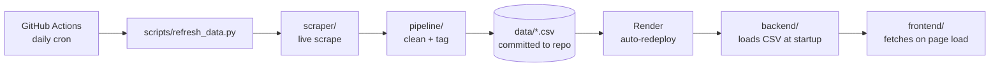

# Architecture

<!--  -->

## System overview

```
scraper/    live data collection (layoffs.fyi, news RSS + articles)
pipeline/   cleaning, standardization, reason-tagging, forecasting
backend/    FastAPI read-only JSON API over the cleaned dataset
frontend/   Next.js site consuming that API
scripts/    scheduled refresh entry point (scrape -> clean -> tag -> commit)
```

Data flows one direction, on a schedule, not on request:



The backend never scrapes live. `tracker_scraper.get_live_tracker_data()`
can take minutes (its slowest fallback path), and reason-tagging makes
per-article HTTP calls — neither belongs inside a web request. All of that
only runs in `scripts/refresh_data.py`, invoked by the scheduled workflow.
The one exception is forecasting: fitting ARIMA on ~78 monthly points is
sub-second, so that's computed per-request.

## Data pipeline

1. **Scrape** (`scraper/tracker_scraper.py`) — layoffs.fyi's Airtable
   shared-view is the primary source (no API token needed: a one-time
   headless-browser visit captures a signed URL, then a plain `GET`
   replays it). Falls back to an Apify actor, then a state WARN Act
   filing page, if the primary source ever breaks.
2. **Clean** (`pipeline/clean.py`) — fuzzy company-name dedup, date/sector
   standardization, funding-stage/country/AI-flag normalization, and a
   transparent tiered headcount-imputation strategy (never silently
   zero-filled).
3. **Tag reasons** (`pipeline/reasons.py`) — each row's own linked news
   article gets fetched and keyword-tagged for a stated reason
   (`scraper/news_scraper.py`); results are cached by URL so repeat runs
   only fetch new articles.
4. **Forecast** (`pipeline/forecast.py`) — a naive rolling-average baseline
   plus ARIMA, both computed on demand by the backend, with a confidence
   audit listing the assumptions each forecast rests on.

## Backend

FastAPI app in `backend/app/`, organized by layer:

- `routers/` — one file per resource (`trend`, `sector`, `reasons`,
  `forecast`, `raw`, `meta`), each a thin HTTP layer.
- `services/` — the actual logic: `aggregations.py` (chart-ready groupbys
  mirroring `pipeline/eda.py`), `forecast_service.py`, `reasons_service.py`,
  `filters.py` (shared sector/stage/country/date-range filtering), and
  `json_safe.py` (NaN/pd.NA -> `null` before any response — pandas'
  missing-value sentinels aren't valid JSON).
- `models/` — Pydantic response schemas.
- `state.py` — loads the dataset once at startup; every router reads from
  that in-memory copy.

Full endpoint list and request/response shapes are self-documented at
`/docs` (FastAPI's built-in OpenAPI UI) once the backend is running.

## Frontend

Next.js App Router, one route per view (`/trend`, `/sector`, `/reasons`,
`/forecast`, `/insights`, `/raw`), each an async server component that
fetches from the backend and passes data to client components for
interactivity (filters, charts, theme toggle). Charts are built with
Recharts; filter/segment state lives in the URL's query string so views
are shareable and bookmarkable.

## Why sector isn't the primary lens

Industry/sector data has a large "Other" catch-all that turns out to be
the single largest bucket by headcount — using it as the primary lens
would put the least informative category at the top of every chart.
Funding **Stage** and **Country** are both better-populated and used
throughout instead; sector is still available as a secondary view, with
its unclassified share shown explicitly rather than hidden.

## Reliability notes

- **No API tokens required.** `AIRTABLE_PAT`/`APIFY_TOKEN` are optional
  faster-path/fallback enhancements the scraper tries first if set — never
  required for the primary source to work.
- **If every live source fails**, the scheduled refresh exits non-zero and
  its commit step never runs — the site keeps serving the last known-good
  data instead of silently going stale or breaking.
- **Reason-tagging is deliberately keyword-based**, not real NLP — its
  coverage percentage is always shown alongside any reason breakdown
  rather than hidden.
- **ARIMA's order is fixed, not auto-tuned**, so its assumptions stay
  visible; the confidence audit flags when a series has too little
  history to trust.
- **The WARN Act fallback** (used only if the primary source and Apify
  both fail) covers a single state and lacks Stage/Country/AI-flag fields
  entirely — `pipeline/clean.py` guards every such field on its source
  column actually being present, so this degrades gracefully.

## Deployment

| Service | Where | Notes |
|---|---|---|
| Frontend | Vercel (free) | Root Directory: `frontend`; env: `NEXT_PUBLIC_API_BASE_URL` |
| Backend | Render (free) | `render.yaml` Blueprint; env: `FRONTEND_ORIGINS` |
| Data refresh | GitHub Actions (free) | `.github/workflows/refresh-data.yml`, daily cron, no secrets required |
| Keep-alive | GitHub Actions (free) | `.github/workflows/keep-alive.yml` pings the backend every ~10 min so Render's free tier doesn't sleep |

Render's free tier sleeps after ~15 min idle without the keep-alive
workflow; a cold start costs ~30–60s (`pandas`/`statsmodels` import time).
